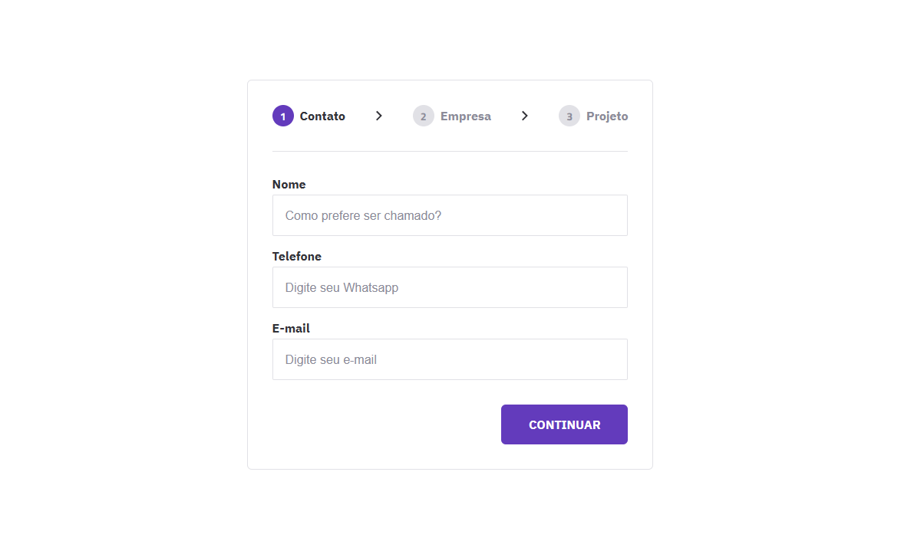

# Projeto de Formulário Multistep

Este projeto consiste em um formulário multistep desenvolvido com HTML, CSS e JavaScript. O objetivo é permitir que os usuários preencham informações em várias etapas, facilitando a navegação e o acompanhamento do processo.

## Funcionalidades

- O formulário é dividido em várias etapas, permitindo que o usuário avance e retroceda conforme necessário.
- Cada etapa contém campos específicos que devem ser preenchidos.
- Os campos obrigatórios são marcados e validados antes do envio do formulário.
- O usuário pode revisar e editar as informações inseridas nas etapas anteriores.

## Tecnologias Utilizadas

- HTML: Utilizado para estruturar o formulário e seus elementos.
- CSS: Utilizado para estilizar o formulário e torná-lo visualmente atraente.
- JavaScript: Utilizado para manipular a lógica do formulário, controlar as etapas, e validar campos.

## Uso

1. Clone ou faça o download deste repositório.
2. Abra o arquivo `index.html` em um navegador da web.
3. Preencha o formulário seguindo as etapas fornecidas.
4. Avance e retroceda entre as etapas usando os botões fornecidos.
5. Certifique-se de preencher corretamente todos os campos obrigatórios.
6. Após a conclusão do formulário, os dados serão submetidos ou tratados conforme a necessidade do projeto.

## Personalização

- Você pode personalizar a aparência e o estilo do formulário editando as classes CSS fornecidas.
- Adicione ou remova etapas conforme necessário, atualizando o HTML e o JavaScript correspondentes.
- Implemente a lógica de validação adicional, como validação de formato de email ou verificação de senha.

## Contribuição

Contribuições são bem-vindas! Sinta-se à vontade para abrir uma issue para relatar problemas, sugerir melhorias ou enviar um pull request com suas modificações.

## Licença

Este projeto está licenciado sob a [Licença MIT](LICENSE).
